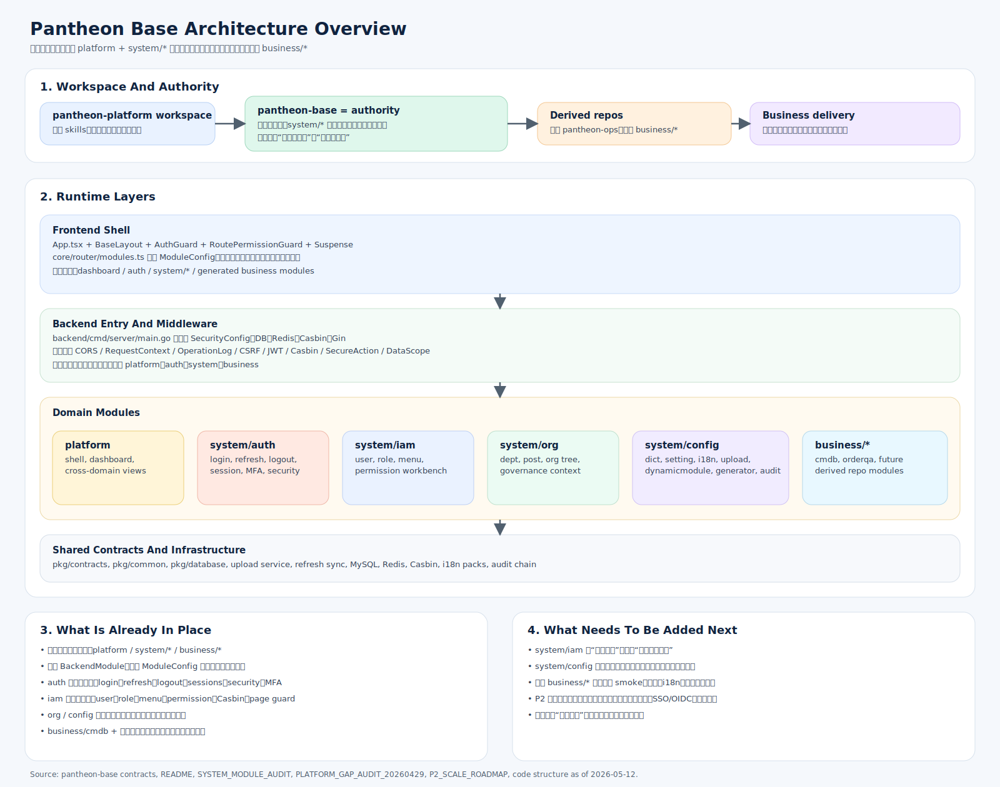

# Pantheon Base 架构总览

---

本文的目标不是替代细分设计文档，而是给第一次接手 Pantheon 的研发一个全局地图：

- 这个系统到底是什么
- 架构分几层
- 代码和运行时如何串起来
- 目前已经做到哪一步
- 后面还要继续补什么

## 1. 一句话理解

Pantheon Base 不是“登录页 + 菜单 + CRUD 模板”，而是一个面向企业后台的**模块化单体底座**。

它把公共能力沉淀在 `platform + system/*`，再通过统一模块契约把 `business/*` 接进来，目标是同时解决四件事：

1. 公共底座长期稳定演进
2. 业务模块不反向污染底座边界
3. 菜单、权限、i18n、审计、配置可以统一治理
4. AI 和新研发能快速理解项目结构并持续扩展

## 2. 先建立正确心智模型

### 2.1 它是一个工作区，不只是一个仓库

`pantheon-platform` 是工作区，`pantheon-base` 是架构和合同的权威来源，`pantheon-ops` 这类派生仓库负责自己的 `business/*`。

所以真正的关系不是：

- 一个大仓库里什么都往里塞

而是：

- `pantheon-base` 定义底座
- 派生仓库继承底座
- 业务能力尽量留在业务仓库

### 2.2 它是模块化单体，不是微服务

后端统一从 `backend/cmd/server/main.go` 启动，统一接入：

- Gin
- 中间件
- 数据库 / Redis / Casbin
- `platform`
- `auth`
- `system`
- `business`

这意味着 Pantheon 当前的基本策略是：

- 先把模块边界做清楚
- 再通过契约和治理降低耦合
- 不为了“看起来高级”过早拆微服务

## 3. 分层怎么看

### 3.1 `platform`：壳层和聚合层

`platform` 负责的是“整个后台像不像一个系统”。

它包含：

- 应用壳层
- 路由装配
- 页面骨架
- 工作台 / 仪表盘
- 平台级状态反馈
- 跨域聚合视图

典型目录：

- 后端：`backend/modules/platform`、`backend/modules/dashboard`
- 前端：`frontend/src/core`、`frontend/src/modules/dashboard`

要点是：`platform` 可以汇总多个系统域或业务域的数据，但不应该侵入单个域的内部职责。

### 3.2 `system/*`：底座公共能力

Pantheon 明确把系统域拆成四块，而不是继续维护一个“大 system 杂物间”。

#### `system/auth`

负责“你是谁、你能否登录、当前会话是否有效”。

当前范围包括：

- 登录 / refresh / logout
- `me`
- 当前账号会话
- 登录日志
- 安全中心
- MFA / TOTP
- 认证安全策略入口

物理落点：

- 后端：`backend/modules/auth`
- 前端：`frontend/src/modules/auth`

#### `system/iam`

负责“你能看到什么、进入什么、操作什么、调用什么”。

当前范围包括：

- 用户
- 角色
- 菜单
- 页面权限
- 按钮权限
- 接口权限
- 权限工作台

物理落点：

- 后端：`backend/modules/system/iam/*`
- 前端：`frontend/src/modules/system/{user,role,menu,permission}`

#### `system/org`

负责组织结构，而不是认证或授权。

当前范围包括：

- 部门
- 岗位
- 组织树
- 用户组织归属依赖的结构治理

物理落点：

- 后端：`backend/modules/system/org/*`
- 前端：`frontend/src/modules/system/{dept,post}`

#### `system/config`

负责配置型公共能力，而且已经不只是“设置页”。

当前范围包括：

- 字典
- 系统设置
- i18n 资产治理
- 上传与存储配置
- 动态模块治理
- 模块生成器
- 刷新同步和部分高敏治理动作

物理落点：

- 后端：`backend/modules/system/{config,i18n,dynamicmodule,generator,audit}`
- 前端：`frontend/src/modules/system/{dict,setting,i18n,dynamicmodule}`、`frontend/src/modules/generator`

### 3.3 `business/*`：业务领域能力

`business/*` 是业务域扩展位，不应该直接耦合底座内部实现。

当前样板包括：

- `backend/modules/business/cmdb`
- 前端 generated business modules

它们应该通过统一契约接入：

- 后端 `BackendModule`
- 前端 `ModuleConfig`
- 菜单 seed
- 权限 seed
- i18n seed
- 页面注册 / 组件注册

## 4. 运行时是怎么串起来的

### 4.1 后端主链路

运行入口在 `backend/cmd/server/main.go`：

1. 初始化公共能力：安全配置、时区等
2. 初始化 MySQL / Redis / Casbin
3. 挂载中间件：CORS、请求上下文、操作日志、CSRF
4. 注册 `platform`、`dashboard`、`system`、`auth`、`business`

其中 `backend/modules/system/system.go` 是系统域装配器，它会把各个系统子模块的：

- 迁移
- 菜单 seed
- 权限 seed
- i18n seed
- 路由注册

统一收口。

### 4.2 前端主链路

前端运行时大致分三层：

1. `App.tsx`
2. `frontend/src/core/*`
3. `frontend/src/modules/*`

关键点：

- `App.tsx` 统一挂认证守卫、路由和二次验证弹层
- `core/router/modules.ts` 统一聚合模块 manifest
- `RoutePermissionGuard` 统一消费页面权限
- `BaseLayout` 统一承载导航、壳层和页面容器

也就是说，Pantheon 前端不是“每个页面自己找地方挂”，而是“所有页面都先声明成模块，再由底座装配”。

### 4.3 模块接入主链路

一个新模块真正要接入 Pantheon，至少要补齐这几件事：

1. 后端模块代码
2. 路由注册
3. 菜单 seed
4. 权限点
5. i18n key / 资源
6. 前端模块 manifest
7. 页面组件注册
8. 验收和 smoke

所以 Pantheon 的核心不是“有没有模块目录”，而是有没有形成**模块契约闭环**。

## 5. 目前已经做到了什么

结合代码、合同文档、评估和路线图，当前可以把 Pantheon Base 判断为“架构骨架已经成型，主链路多数闭环，正在从底座建设进入治理深化阶段”。

### 5.1 已经稳定的底层骨架

- 模块化单体入口稳定
- `platform / system/* / business/*` 三层语言已经固定
- 后端 `BackendModule` 契约已落地
- 前端 `ModuleConfig` manifest 已落地
- 动态菜单、组件注册和显式模块装配已经成型

### 5.2 已闭环的系统主链路

- `system/auth`：登录、刷新、注销、会话、安全中心、登录日志、MFA
- `system/iam`：用户、角色、菜单、权限管理、页面守卫、Casbin 策略
- `system/org`：部门、岗位、组织治理基础闭环
- `system/config`：字典、设置、i18n、上传、动态模块、生成器的主体能力已落地

### 5.3 已经进入“治理型能力”的部分

- 权限工作台可以发现缺口、解释缺口、导出治理信息
- 动态模块和生成器已经按高敏能力治理，而不是普通配置页
- 系统设置已经有敏感配置加密、配置审计和缓存刷新
- i18n 已经从“静态文案文件”升级到运行时资产治理

### 5.4 已经开始验证业务接入

- `business/cmdb` 已作为业务样板进入设计与验收主链
- 数据权限中间件、角色数据范围策略、`dept_and_children` 扩展已经落地
- 业务模块不再只是理论扩展位，而是已经开始走真实接入验证

## 6. 现在最大的风险是什么

当前的主要风险不是“功能太少”，而是：

> 实现版图一度比设计和验收版图长得更快。

虽然这轮文档已经补了很多锚点，但从全局看，仍然有三类风险要盯住。

### 6.1 `system/config` 仍然最容易继续膨胀

因为它同时承载：

- 字典
- 设置
- i18n
- 上传
- 动态模块
- 生成器

如果没有持续的分级治理，它会再次变成新的“大杂烩系统域”。

### 6.2 `system/iam` 还没有完全走到“整改闭环”

当前已经完成：

- 发现问题
- 解释问题
- 导出问题

下一阶段还要补：

- 整改追踪
- 治理闭环回写
- 风险角色处理路径

### 6.3 `business/*` 还需要更多真实样板

现在底座已经有 `cmdb` 这类真实业务样板，也验证过临时模块生成与清理闭环，但这还不足以证明：

- 所有业务模块都能稳定接入
- 所有业务模块都能稳定通过权限 / i18n / 审计 / 数据范围治理

换句话说，业务域接入机制已经可用，但还需要更多样板把它“压实”。

## 7. 未来优先补什么

在 2026-05 之后，Pantheon Base 的升级不再适合按零散缺口推进，而应按“两阶段平台升级”组织：

1. 先收口 Harness Engineering，让后续跨层能力补齐有统一执行协议。
2. 再补标准后台能力，让 `pantheon-base` 从“强底座”提升到“标准企业后台产品底座”。

### 7.1 近期优先级

#### 第一阶段：Harness Engineering 收口

主责层：`platform`

目标：

- 非 trivial 变更默认需要 task packet。
- evidence 不是可选附件，而是固定交付物。
- UI 任务的视觉证据进入固定门禁。
- review、PR 描述和 CI artifact 使用同一组输入输出结构。

这一阶段不是继续堆规范，而是把现有协议推进成默认执行路径。

#### 第二阶段：标准后台能力补齐

主责层：`platform + system/auth + system/iam + system/config + business/*`

目标：

- 在不破坏现有 `platform / system/* / business/*` 分层的前提下，补齐企业后台常见的基础治理能力和产品化控制台骨架。
- 先补清楚抽象边界、模型契约、治理约束和验收口径，再决定哪些方向进入真实深实现。

第二阶段内部按四条专题线推进：

1. `auth-scale`
2. `platform-ops`
3. `governance-core`
4. `enterprise-backoffice`

### 7.2 P2 演进方向

根据 [P2_SCALE_ROADMAP.md](./P2_SCALE_ROADMAP.md)，后续明确要走的方向是：

1. 数据权限继续扩展到更多业务模块
2. 租户就绪审查继续深化，再决定真实多租户
3. SSO / OIDC 在身份源明确后实现
4. 登录风控继续从节流走向新设备 / 异地识别 / 高风险 MFA
5. 业务模块自动化验收常态化

### 7.3 第二阶段四条专题线

#### `auth-scale`

目标是把 `system/auth` 做到 `sso-ready`、`captcha-ready`、`risk-ready`。

本线应补：

- provider 抽象与本地账号兜底策略
- 外部身份绑定模型与审计语义
- 登录告警、风险事件和安全策略页增强
- 在身份源未知前的接口契约、配置契约和文档锚点

本线不应提前做：

- 真实 OIDC / LDAP / 企业微信 / 钉钉 provider 接入
- 单点登出联邦语义

#### `platform-ops`

目标是把平台壳层从“导航 + dashboard”推进到真正的运营控制台骨架。

本线应补：

- 通知中心的真实消息模型与跳转契约
- dashboard widget 注册治理继续收口
- 用户偏好体系：导航模式、表格密度、工作台偏好
- 平台级待办/告警摘要的统一入口

#### `governance-core`

目标是把已存在的治理能力从“发现问题”推进到“持续治理并留痕”。

本线应补：

- 权限工作台整改追踪闭环
- 数据权限扩面到更多业务样板
- 动态模块 / 生成器的交付治理链
- 高敏治理页的审计与验收基线增强

#### `enterprise-backoffice`

目标是补齐企业后台常见产品化控制台骨架，但坚持“先骨架与治理，再深入业务流”。

本线应补：

- 审批流骨架
- 任务中心
- 调度中心
- 报表中心
- 监控告警中心

本线当前强调的是：

- 先立合同、设计和模块边界
- 至少形成最小真实闭环样板
- 不在一轮内把它们直接做成完整独立产品

### 7.4 还没有真正进入实现的内容

以下方向目前是“已设计 / 已预留 / 待明确边界”，不应该误判成“已经支持”：

- 真实多租户
- 真实 SSO / OIDC provider 接入
- 完整登录风控
- 大规模业务模块 smoke 常态化
- 完整审批流引擎
- 全功能报表与 BI 平台
- 完整监控/APM 平台

## 8. 建议怎么读这个项目

如果你是第一次进入 Pantheon，建议按这个顺序建立认知：

1. 先读 `DESIGN.md`
2. 再读 `docs/contracts/*`
3. 再读 `docs/designs/BACKEND.md`、`FRONTEND.md`、`MODULE_CONTRACT.md`
4. 然后只读你所在层的细分设计文档
5. 最后看对应 acceptance / assessment

理解方法建议也很简单：

- 先分清层：`platform` 还是 `system/*` 还是 `business/*`
- 再分清域：`auth / iam / org / config`
- 再看模块是“真实实现”、还是“治理增强”、还是“未来预留”

只要这三步不混，Pantheon Base 的全局结构就不会看乱。
