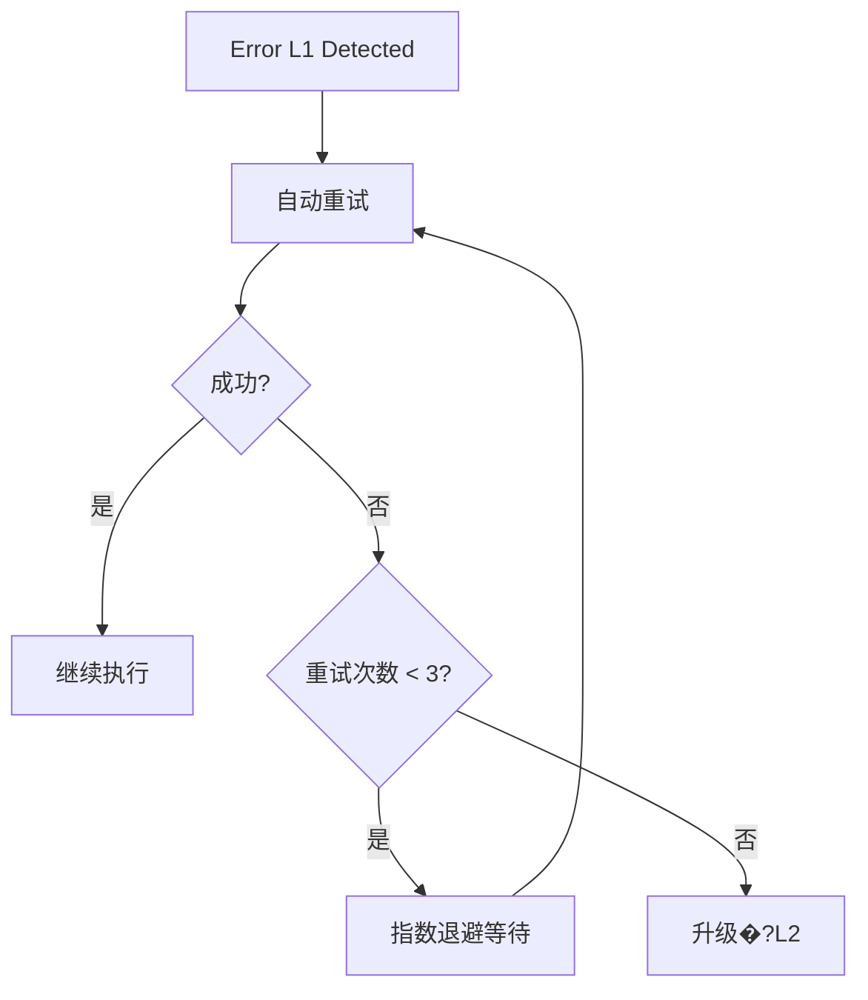
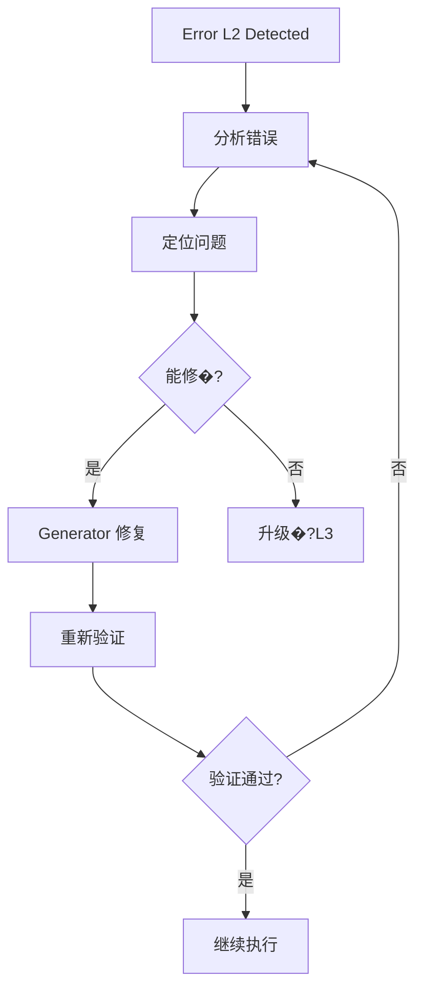

# 错误恢复策略

English version: [ERROR_RECOVERY_STRATEGY.en.md](./ERROR_RECOVERY_STRATEGY.en.md)

本文定义 harness 中的错误分类和恢复策略�?

## 0. 版本历史

| 版本 | 日期       | 变更                                         |
| ---- | ---------- | -------------------------------------------- |
| v1.0 | 2026-06-26 | 初始版本：L1-L4 错误分类、恢复流程、回滚机�? |

## 1. 概述

错误恢复策略确保 agent 在遇到错误时能够系统性地处理，而不是随机重试或直接放弃�?

## 2. 错误分类

### 2.1 分类级别

| 级别 | 类型   | 示例                           | 自动恢复 |
| ---- | ------ | ------------------------------ | -------- |
| L1   | 可重�? | 网络超时、依赖拉取失�?         | �?       |
| L2   | 可修�? | Lint 错误、测试失�?            | �?       |
| L3   | 需澄清 | 需求歧义、scope 漂移           | �?       |
| L4   | 需升级 | 架构冲突、安全问题、Human Gate | �?       |

### 2.2 详细分类说明

#### L1: 可重�?

**特征**: 临时性失败，重试后可能成�?
**示例**: 网络请求超时、npm/pip/go mod 下载失败

**处理**: 自动重试，指数退避（1s, 2s, 4s�?

#### L2: 可修�?

**特征**: 代码或配置问题导致，需要代码修改才能解�?
**示例**: Lint 错误、单元测试失败、TypeScript 类型错误

**处理**: Generator 修复后重新验�?

#### L3: 需澄清

**特征**: 需求或范围不明�?
**示例**: 需求歧义、Scope 漂移、依赖项冲突

**处理**: Planner 介入澄清

#### L4: 需升级

**特征**: 高风险或需�?Human 决策

**示例**: 架构冲突、安全漏洞、数据库 schema 变更、Human Gate

**处理**: Human Gate

## 3. 恢复流程

### 3.1 L1 恢复流程



### 3.2 L2 恢复流程



### 3.3 升级路径

```
L1 失败 3 �?-> L2
L2 失败 3 �?-> L3
L3 无法澄清 -> L4
L4 Human 拒绝 -> 任务终止
```

## 4. 回滚机制

### 4.1 回滚触发条件

对于破坏性变更，以下情况应触发回滚：

- 部署后系统不可用
- 数据丢失或损�?- 安全漏洞被引�?

### 4.2 Task Packet 中的回滚计划

对于破坏性变更，Task Packet 必须包含回滚计划�?

```markdown
## Rollback Plan

**Trigger Condition**: <什么情况下触发回滚>

**Rollback Steps**:

1. `git revert <commit-hash>`
2. `restore <备份文件>`

**Verification**:

- [ ] 功能验证命令
- [ ] 数据验证命令
```

## 5. 工具适配指南

工具 adapter 必须支持�?

1. **错误分类**: 能够识别 L1-L4 错误
2. **自动重试**: L1 错误自动重试，指数退�?3. **升级路径**: 按规则升级到下一级别

工具 adapter 不应�?

- 忽略 L1 错误而不重试
- 跳过 L2/L3 修复直接升级
- 绕过 Human Gate 继续执行 L4 任务

## 6. �?pantheon-harness 同步

Canonical 源：`pantheon-harness/docs/harness/ERROR_RECOVERY_STRATEGY.md`

本文件为 pantheon-base 本地投影，如�?Canonical 冲突，以 Canonical 为准�?
