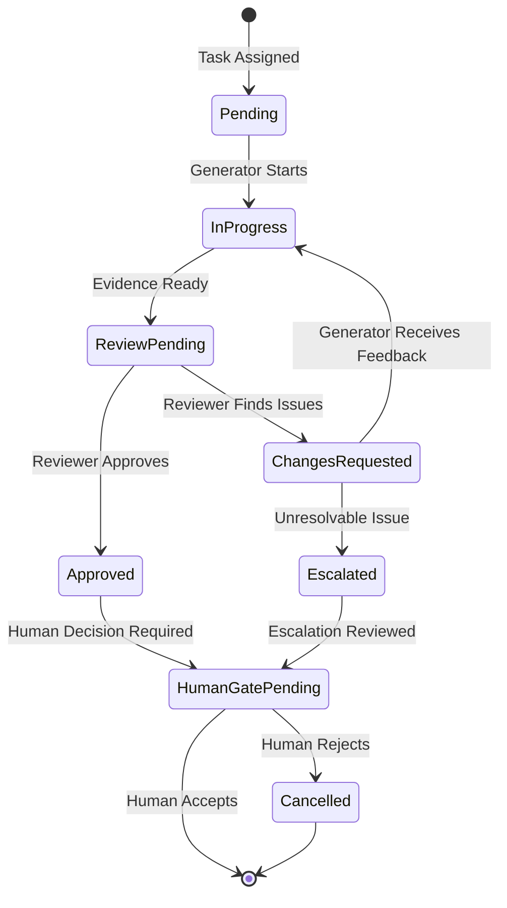

# Agent 间交接协�?

English version: [HANDOFF_PROTOCOL.en.md](./HANDOFF_PROTOCOL.en.md)

本文定义 agent 间交接的标准化流程、状态机和检查清单�?

## 0. 版本历史

| 版本 | 日期       | 变更                                     |
| ---- | ---------- | ---------------------------------------- |
| v1.0 | 2026-06-26 | 初始版本：交接触发条件、状态机、检查清�? |

## 1. 概述

交接协议确保 agent 间的协作有明确的边界、状态和检查点。它定义了：

- 何时触发交接
- 交接时必须传递什么信�?- 交接后的状态如何追�?- 交接失败如何处理

## 2. 交接触发条件

| 场景                  | 触发�?     | 接收�?    | 触发条件                                 |
| --------------------- | ---------- | --------- | ---------------------------------------- |
| Planner -> Generator  | Planner    | Generator | Task Packet 准备完成，所有必填字段已填充 |
| Generator -> Reviewer | Generator  | Reviewer  | 实现完成 + Evidence 已生�?               |
| Reviewer -> Planner   | Reviewer   | Planner   | 发现问题需要澄清，或需要重�?             |
| Reviewer -> Human     | Reviewer   | Human     | Human Gate 触发                          |
| 任何阶段 -> Human     | 任一 agent | Human     | 阻塞性问题、破坏性变更、安全问�?         |

## 3. 交接状态机



### 状态定�?

| 状�?               | 说明                 | Owner     |
| ------------------ | -------------------- | --------- |
| `Pending`          | 任务已分配，等待执行 | Planner   |
| `InProgress`       | 正在执行             | Generator |
| `ReviewPending`    | 等待 Review          | Reviewer  |
| `ChangesRequested` | 需要修�?             | Generator |
| `Approved`         | Review 通过          | Reviewer  |
| `HumanGatePending` | 等待 Human 决策      | Human     |
| `Escalated`        | 问题升级             | Planner   |
| `Cancelled`        | 任务取消             | -         |

## 4. 交接检查清�?

### 4.1 Planner -> Generator 交接检�?

在将任务交接�?Generator 之前，Planner 必须确认�?

- [ ] Task Packet 完整且所有必填字段已填充
- [ ] Scope 已明确（In/Out 清晰�?- [ ] Verification Plan 定义了具体的验证命令
- [ ] Stop Points 已标注（如有�?- [ ] Human Gates 已列出（如有�?- [ ] 已明确禁止触碰的区域
- [ ] 依赖项已确认（blockedBy 已解决）
- [ ] Rollback Plan 已准备（如为破坏性变更）

### 4.2 Generator -> Reviewer 交接检�?

在将任务交接�?Reviewer 之前，Generator 必须确认�?

- [ ] 代码改动�?Task Packet 范围�?- [ ] 所有验证命令已执行
- [ ] Evidence 已生成并符合质量标准
- [ ] 无阻塞�?lint/typecheck 错误
- [ ] Commit 消息符合规范
- [ ] 已知问题已记�?- [ ] 未运行验证已记录原因
- [ ] Task Packet 中的 Success Criteria 已验�?

### 4.3 Reviewer -> Human 交接检�?

在将任务交接�?Human 之前，Reviewer 必须确认�?

- [ ] Review 结论明确（通过/需修改/阻塞�?- [ ] 所�?Findings 有优先级标注（P0/P1/P2�?- [ ] 建议的修复方向具体可执行
- [ ] UI 任务有渲染证�?- [ ] 剩余风险已说�?

### 4.4 Human -> 任一阶段 交接检�?

Human 决策后必须提供：

```markdown
## Human Decision

**Task ID**: <task-id>
**Decision Type**: approve | reject | clarify | escalate
**Decision Content**: <具体决策描述>
**Risk Accepted**: yes | no | with-mitigation
**Next Action**: <具体行动�?owner>
```

## 5. 交接失败处理

### 5.1 信息不完�?

**症状**: 接收者发�?Task Packet �?Evidence 缺少必要信息

**处理流程**:

1. Reviewer/Generator 标注缺失�?2. 返回 Task Packet 并注明缺失原�?3. Planner 补充后重新交�?4. 记录到状态历�?

### 5.2 范围漂移

**症状**: 实现超出 Task Packet 范围

**处理流程**:

1. Reviewer 标记 scope drift
2. Planner 重审 scope
3. Generator 停止直到 scope 澄清
4. 如需扩大范围，更�?Task Packet 并获�?Human 批准

### 5.3 验证失败

**症状**: 验证命令未通过

**处理流程**:

1. Generator 分析失败原因
2. 修复问题
3. 重新运行验证
4. 如连续失败，升级�?Human Gate 或终止任�?

## 6. 工具适配指南

工具 adapter 必须支持�?

1. **状态追�?*: 读取和更�?`.harness/state/<task-id>/status.md`
2. **检查清单验�?*: 在交接前验证所有必填项
3. **状态机执行**: 遵循定义的状态转换规�?
   工具 adapter 不应�?

- 跳过检查清单项而不记录原因
- 在未生成 Evidence 前触�?Review 交接
- 绕过 Human Gate 直接完成任务

## 7. �?pantheon-harness 同步

Canonical 源：`pantheon-harness/docs/harness/HANDOFF_PROTOCOL.md`

本文件为 pantheon-base 本地投影，如�?Canonical 冲突，以 Canonical 为准�?
