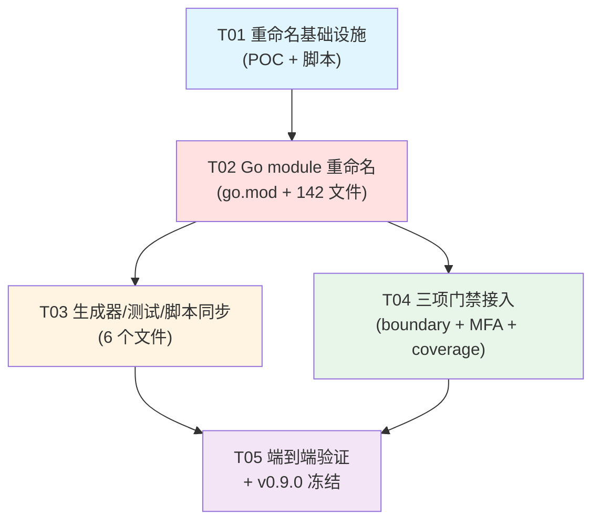

# pantheon-base v0.9.0 遗留问题处理 — 系统设计与任务分解

- **作者**: Bob (Architect)
- **日期**: 2026-07-15
- **范围**: Go module 重命名残留修复 + fix-report 第四节三项门禁
- **审阅人**: 维护者（小龙）

---

## Part A 系统设计

### 1. 实现方案与框架/工具选型

#### 1.1 核心技术挑战

| 挑战 | 分析 |
|---|---|
| **批量重命名的可回退性** | 142 个 `.go` 文件、339 处 import，必须一次提交内完成，且失败能整单回滚 |
| **替换的精确性** | 不能误伤文档/物理路径（`D:\workspace\go\pantheon-platform\...`）、历史 evidence、ops 已锁定 release artifact |
| **替换的完备性** | 除 `.go` 源文件外，还要覆盖生成器模板、smoke 断言、清理脚本正则、drift 归一化 |
| **可审查性** | diff 必须清晰可读，不能出现意外换行/空白差异 |
| **CI 可守护** | 三项门禁（boundary / MFA / coverage）要接入现有 `.github/workflows/ci.yml`，不破坏现有 job |

#### 1.2 批量重命名方案选型（核心决策）

| 方案 | 优点 | 缺点 | 结论 |
|---|---|---|---|
| `gopls rename` | AST 级精确 | 需要 LSP 客户端脚本化，142 文件调用复杂 | ❌ 过度工程 |
| `gofmt -r` | Go 官方、保格式 | 是 AST 重写规则，不是字符串替换；改 import 路径需写 rule，笨拙 | ❌ 不适合 |
| `eg` (example-based refactoring) | 精确 | 需额外安装 Go 工具，团队陌生 | ❌ 引入学习成本 |
| **批量 `sed`（流编辑）** | 简单、透明、跨平台（Git Bash/PowerShell 都有）、易审查 diff | 需要小心边界符 | ✅ **采用** |
| IDE 全局替换（VSCode `Ctrl+Shift+H`） | 可视化 | 不可脚本化、不可重现 | ❌ 不合规 |

**最终方案：分层 sed 脚本 + 验证脚本**

工具组合：
- **执行**：`bash scripts/maintenance/rename-module.sh`（新建）调用 `find + sed -i`，仅处理白名单目录（`backend/`、`frontend/src/modules/lowcode/generator/`、`frontend/tests/smoke/business/generated/`、`frontend/scripts/cleanup-generated-modules*`、`scripts/harness/triage-base-drift.mjs`）。
- **模式**：替换 `"pantheon-platform/` → `"pantheon-base/`（带前导引号，确保只命中 import 字符串 / 字符串字面量，不命中物理路径）。
- **验证**：`scripts/maintenance/verify-module-rename.sh`（新建）跑 `grep -r "pantheon-platform/" backend/ frontend/ scripts/`，输出必须为 0 或仅命中允许豁免的文档。
- **回退**：单 commit + `git revert`；或本地分支 `fix/v090-module-rename`，废弃即 `git reset --hard origin/main`。
- **审查**：用 `git diff --stat` + `git diff -U0` 展示行级变更，每行只改一处字符串。

**为什么不用 gopls/eg**：本项目替换是纯字符串字面量替换，无符号重命名，无需 AST；sed 在 review 时是最直观的形式。

#### 1.3 business/* 边界门禁设计（fix-report 项 1）

**双层防护**：

1. **`scripts/harness/check-boundaries.mjs` 升级为 CI 阻断**：
   - 该脚本已支持 `--strict`（exit 1 on findings），无需改代码。
   - 在 `.github/workflows/ci.yml` 新增 `boundary-gate` job，运行 `node scripts/harness/check-boundaries.mjs --strict`。
   - **额外**：把 `REPOSITORIES` 改为只 `['pantheon-base']`（在 base 仓库 CI 里只关心自己），通过新增 CLI 参数 `--repo pantheon-base` 支持。改动量小。

2. **golangci-lint `depguard` 规则**（`backend/.golangci.yml`）：

   ```yaml
   linters:
     enable:
       - depguard
     settings:
       depguard:
         rules:
           business-no-system-internals:
             files:
               - $all
               - "!$test"
             allow:
               - $gostdlib
               - pantheon-base/pkg/**
               - pantheon-base/internal/**
               - pantheon-base/modules/business/**
               - pantheon-base/modules/lowcode/**   # 生成器需要
               - github.com/**
               - gorm.io/**
               - go.uber.org/**
               - go.opentelemetry.io/**
               - golang.org/**
               - google.golang.org/**
               - gopkg.in/**
             deny:
               - pkg: pantheon-base/modules/system
                 desc: business modules must not import system internals; use pkg/contracts
               - pkg: pantheon-base/modules/auth
                 desc: business modules must not import auth internals
               - pkg: pantheon-base/modules/platform
                 desc: business modules must not import platform internals
   ```
   - **应用范围**：仅 `backend/modules/business/**/*.go` 文件。depguard 不直接支持"只对某目录启用规则"，但可用 `files` 字段的 glob 限制（golangci-lint v2 语法：`files: ["backend/modules/business/**/*.go"]`）。需要验证。
   - **简化方案**（推荐起步）：把 depguard 应用于全 backend，deny `modules/business` import `modules/system`、`modules/auth`、`modules/platform`（除 `pkg/contracts`）。即"反向规则"——business 文件不允许引用这些前缀。

   **推荐起步规则**（更直观）：
   ```yaml
   depguard:
     rules:
       business-boundary:
         files:
           - "modules/business/**/*.go"
         deny:
           - pkg: pantheon-base/modules/system
             desc: use pantheon-base/pkg/contracts instead
           - pkg: pantheon-base/modules/auth
             desc: use pantheon-base/pkg/contracts instead
           - pantheon-base/modules/platform
   ```

#### 1.4 MFA 生产基线（fix-report 项 2）

仅改 `docs/DEPLOYMENT_GUIDE.md`：
- 在"部署前准备"或"安全基线"章节增加强制项表格
- 推荐位置：在 §3（生产环境配置）新增 §3.1 "强制安全基线"
- 内容：表格列出 `login.mfa_enabled=1`、`session.secure_cookie=true`、`csrf.enabled=true`、`audit.enabled=true` 等
- 形式：Markdown 表格 + 一段说明，附 `curl -X POST /system/settings` 示例

#### 1.5 测试覆盖率门禁（fix-report 项 3）

**接入方式**：

在 `.github/workflows/ci.yml` 新增 `coverage-gate` job：
```yaml
coverage-gate:
  runs-on: ubuntu-latest
  needs: [unit-tests]
  steps:
    - uses: actions/checkout@...
    - uses: actions/setup-go@...
    - name: Run coverage
      working-directory: backend
      run: |
        go test -coverprofile=coverage.out -covermode=atomic ./...
        go tool cover -func=coverage.out > coverage.txt
    - name: Check threshold
      working-directory: backend
      run: node ../scripts/harness/check-coverage.mjs coverage.txt --threshold 60
```

**新建 `scripts/harness/check-coverage.mjs`**：
- 解析 `go tool cover -func` 输出
- 按包维度（`pantheon-base/modules/system/...`）求平均
- 总覆盖率 < 60% 则 exit 1
- 输出报告（哪些包达标/不达标）
- 后续版本 ratchet 至 80%

**不引入第三方工具**（如 codecov），保持自包含。

---

### 2. 文件清单（按改动类型分组）

#### A. 新建（维护脚本 + 门禁脚本）

| 文件 | 用途 |
|---|---|
| `scripts/maintenance/rename-module.sh` | 一次性批量重命名脚本（sed 编排） |
| `scripts/maintenance/verify-module-rename.sh` | 重命名后验证脚本 |
| `scripts/harness/check-coverage.mjs` | 覆盖率阈值检查 |
| `docs/system_design.md` | 本文档 |
| `docs/class-diagram.mermaid` | 类图 |
| `docs/sequence-diagram.mermaid` | 时序图 |

#### B. 修改（Go module + 源码 import）

| 文件 | 改动 |
|---|---|
| `backend/go.mod` | L1: `module pantheon-platform` → `module pantheon-base` |
| `backend/cmd/server/main.go` | 10 处 import |
| `backend/modules/**/*.go`（约 90 个） | 批量 import 替换 |
| `backend/internal/**/*.go`（约 25 个） | 批量 import 替换 |
| `backend/pkg/**/*.go`（约 26 个） | 批量 import 替换 |

合计：**142 个 .go 文件，339 处 import**

#### C. 修改（前端生成器 + 测试 + 脚本）

| 文件 | 行号 | 改动 |
|---|---|---|
| `frontend/src/modules/lowcode/generator/backendGenerator.ts` | 283, 284, 575, 712, 713 | 模板内 `"pantheon-platform/pkg/common"` 等 5 处 → `pantheon-base/...` |
| `frontend/tests/smoke/business/generated/module-governance-host-real.spec.ts` | 329, 392 | 断言 `pantheon-base/modules/business/...` |
| `frontend/tests/smoke/business/generated/module-governance-real.spec.ts` | 178, 218 | 同上 |
| `frontend/scripts/cleanup-generated-modules.mjs` | 192 | 正则 `pantheon-platform\/backend\/modules\/business\/` → `pantheon-base\/modules\/business\/`（去除 `backend/` 段） |
| `frontend/scripts/cleanup-generated-modules.test.mjs` | 69, 114 | fixture 字符串同步规范化为 `pantheon-base/modules/business/mdqaorder` |
| `scripts/harness/triage-base-drift.mjs` | 162 | `.replaceAll('pantheon-platform/backend', 'MODNAME/backend')` → `.replaceAll('pantheon-base/backend', 'MODNAME/backend')` |

#### D. 修改（门禁配置）

| 文件 | 改动 |
|---|---|
| `backend/.golangci.yml` | 启用 `depguard`，添加 business-boundary 规则 |
| `scripts/harness/check-boundaries.mjs` | 增加 `--repo <name>` CLI 参数支持（默认仍扫全部） |
| `.github/workflows/ci.yml` | 新增 `boundary-gate` 和 `coverage-gate` 两个 job |
| `docs/DEPLOYMENT_GUIDE.md` | 新增"生产强制安全基线"章节，含 `mfa_enabled=1` |

#### E. 不改动（明确豁免）

- `docs/**/*.md` 中所有 `D:\workspace\go\pantheon-platform\...` 物理路径引用（父目录名保留）
- `.harness/evidence/**` 历史文件
- `pantheon-ops/.foundation/releases/base-v*/**` 已锁定 artifact
- `backend/DEV_DB_INIT_GUIDE.md` 中的 `pantheon-platform` 字符串（独立审查，建议同步改但不阻塞）——**待维护者拍板**

---

### 3. 数据结构与接口（class diagram）

详见 `docs/class-diagram.mermaid`。

**核心映射关系**：

```
module 声明:    module pantheon-base      (backend/go.mod L1)

import 前缀:    pantheon-base/<子路径>
                ↑ 永不带 backend/ 段（go.mod 已在 backend/ 内）

物理路径:      D:\workspace\go\pantheon-platform\pantheon-base\backend\pkg\common
                ↑ 物理路径保留 pantheon-platform 父目录名（不动）
                
import 路径:    "pantheon-base/pkg/common"
                ↑ 与物理路径解耦，由 go.mod 决定
```

---

### 4. 程序调用流程（sequence diagram）

详见 `docs/sequence-diagram.mermaid`。四阶段：
1. module 声明 + Go 源码批量改写
2. 代码生成器模板更新
3. 测试断言 + 清理脚本 + drift 脚本同步
4. 三项门禁接入 CI

---

### 5. 已决事项（维护者小龙 2026-07-15 拍板）

| # | 事项 | 决策 | 落地要点 |
|---|---|---|---|
| Q1 | `backend/DEV_DB_INIT_GUIDE.md` 里的 `pantheon-platform` 是否同步改？ | **A 同步改** | 5 处一并 sed，无成本 |
| Q2 | `docs/designs/MODULE_GENERATOR_EXTENSION.md` 等设计文档中的引用是否改？ | **B 仅改影响代码示例的** | 历史叙述性引用保留作参考 |
| Q3 | depguard `files` glob 是否支持按目录限定？ | **POC 先行** | 验证失败则用"全 backend deny 反向规则"兜底 |
| Q4 | 覆盖率初始阈值？ | **先实测再定** | 跑一次 `go test -coverprofile` 看现状，以**现状的 90%** 作为初始阈值，后续 ratchet 到 80% |
| Q5 | base CI 是否跨仓库扫 ops？ | **A 各扫各的** | base CI 用 `--repo pantheon-base`，ops 自己 CI 负责自己 |
| Q6 | commit 颗粒度？ | **A 按任务单 commit** | T02/T03/T04/T05 各一个原子 commit，可独立 revert |
| Q7 | 是否留 `replace` 兜底兼容？ | **A 彻底切割** | 不留 go replace |

---

## Part B 任务分解

### 6. 依赖包列表

无新增第三方依赖。所有工具均使用仓库内已有：

- Go 1.26.5（已有）
- golangci-lint v2.6.2（已有，CI 中安装）
- Node 22（已有）
- GNU sed（Git Bash 自带）

如需在本机一次性跑覆盖率分析，无需新增包；`go tool cover` 是 Go 自带。

### 7. 任务列表

> **硬性约束**：≤ 5 任务，按依赖排序，首任务为基础设施。

#### T01 — 重命名基础设施（POC + 脚本 + 验证）

- **Source Files**:
  - `scripts/maintenance/rename-module.sh`（新建）
  - `scripts/maintenance/verify-module-rename.sh`（新建）
  - `scripts/maintenance/README.md`（新建，说明用法）
  - `docs/system_design.md`（本文档，新建）
  - `docs/class-diagram.mermaid`（新建）
  - `docs/sequence-diagram.mermaid`（新建）
- **Dependencies**: 无
- **Priority**: P0
- **Acceptance**: 维护者审阅通过本方案；脚本可空跑（`--dry-run`）输出影响面。

#### T02 — Go module 声明 + 源码批量改写

- **Source Files**:
  - `backend/go.mod`
  - `backend/cmd/server/main.go`
  - `backend/modules/**/*.go`（90 个）
  - `backend/internal/**/*.go`（25 个）
  - `backend/pkg/**/*.go`（26 个）
- **Dependencies**: T01
- **Priority**: P0
- **Acceptance**:
  - `cd backend && go build ./... && go vet ./...` 通过
  - `gofmt -l .` 无输出
  - `go test -race -short ./...` 全绿
  - `grep -r "pantheon-platform/" backend/` 仅命中 `DEV_DB_INIT_GUIDE.md`（或按 Q1 决定同步改）

#### T03 — 生成器模板 + 测试断言 + 脚本同步

- **Source Files**:
  - `frontend/src/modules/lowcode/generator/backendGenerator.ts`（5 处模板字符串）
  - `frontend/tests/smoke/business/generated/module-governance-host-real.spec.ts`
  - `frontend/tests/smoke/business/generated/module-governance-real.spec.ts`
  - `frontend/scripts/cleanup-generated-modules.mjs`
  - `frontend/scripts/cleanup-generated-modules.test.mjs`
  - `scripts/harness/triage-base-drift.mjs`
- **Dependencies**: T02
- **Priority**: P0
- **Acceptance**:
  - `cd frontend && npx tsc --noEmit` 通过
  - `node frontend/scripts/cleanup-generated-modules.test.mjs` 通过
  - 生成器 demo 跑通，生成代码中 import 为 `pantheon-base/...`

#### T04 — 三项门禁接入（boundary / MFA 文档 / coverage）

- **Source Files**:
  - `backend/.golangci.yml`（depguard 规则）
  - `scripts/harness/check-boundaries.mjs`（`--repo` 参数）
  - `scripts/harness/check-coverage.mjs`（新建）
  - `.github/workflows/ci.yml`（boundary-gate + coverage-gate job）
  - `docs/DEPLOYMENT_GUIDE.md`（生产基线章节）
- **Dependencies**: T02（depguard 规则依赖新 module 名）
- **Priority**: P1
- **Acceptance**:
  - `golangci-lint run ./...` 通过，depguard 生效（手动在 business 加一个坏 import 能被拦截）
  - `node scripts/harness/check-boundaries.mjs --strict --repo pantheon-base` exit 0
  - `node scripts/harness/check-coverage.mjs backend/coverage.txt --threshold 60` exit 0
  - CI workflow yaml 通过 `actionlint`（如已配置）

#### T05 — 端到端验证 + 冻结 v0.9.0

- **Source Files**:
  - `VERSION`（如需要从 v0.8.x → v0.9.0）
  - `CHANGELOG.md`（新增 v0.9.0 entry）
  - `.harness/evidence/v090-module-rename.md`（新建，存证）
- **Dependencies**: T03, T04
- **Priority**: P0
- **Acceptance**:
  - `bash scripts/maintenance/verify-module-rename.sh` exit 0
  - 完整 CI 流水线绿
  - 维护者 sign-off，打 `v0.9.0` tag

### 8. 共享知识（跨任务约定）

```
1. **统一新 module 名**: pantheon-base
   - go.mod: `module pantheon-base`
   - 所有 import 前缀: `"pantheon-base/..."`

2. **import 永不带 backend/ 段**:
   - ✅ "pantheon-base/pkg/common"
   - ❌ "pantheon-base/backend/pkg/common"
   - 原因: go.mod 在 backend/ 内，module 名已是根

3. **物理路径与 import 路径解耦**:
   - 物理路径保留 pantheon-platform 父目录（D:\workspace\go\pantheon-platform\pantheon-base）
   - 不影响 import；不改 docs/ 中的物理路径引用

4. **替换模式（sed）**:
   - 仅替换带前导引号/反引号的字面量：`"pantheon-platform/` → `"pantheon-base/`
   - 不替换裸标识符（避免误伤注释中的物理路径或讨论文本）

5. **豁免清单**（不动）:
   - .harness/evidence/**
   - pantheon-ops/.foundation/releases/base-v*/**
   - docs/**/*.md 中的物理路径引用（按 Q2 决定）

6. **commit 策略**:
   - T02 单 commit（"chore: rename go module pantheon-platform → pantheon-base"）
   - T03 单 commit（"chore: sync generator templates and tests with module rename"）
   - T04 单 commit（"ci: add boundary/coverage gates + depguard + MFA baseline doc"）
   - T05 单 commit（"chore(release): v0.9.0 freeze"）

7. **验证三件套（每任务完成必跑）**:
   - cd backend && go build ./... && go vet ./... && go test -race -short ./...
   - cd frontend && npx tsc --noEmit && npx eslint src --max-warnings 0
   - bash scripts/maintenance/verify-module-rename.sh
```

### 9. 任务依赖图



---

## 审阅签署

- [x] 维护者（小龙）审阅通过 — 2026-07-15
- [x] 待明确事项 Q1-Q7 全部拍板 — 见 §5
- [ ] 进入实现阶段（T01 → T05）— 待工程师寇豆码接手

**预计工作量**: T01 0.5d / T02 0.5d / T03 0.5d / T04 1d / T05 0.5d ≈ **3 人日**
